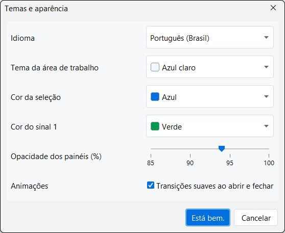

# Logisim Panels — experimental interface

An independent interface experiment for Logisim Evolution 5.1.0-dev. The workspace uses movable panels and a movable, resizable icon toolbar while retaining the original circuit editor and simulator. This is an evaluation release, not an official Logisim Evolution release or a finished upstream integration.

[Português (Brasil)](README.md) · [Evaluation downloads](https://github.com/toybile/logisim-evolution/releases/tag/panels-v0.2.0) · [Upstream integration plan](docs/UPSTREAM-INTEGRATION.md)

## Screenshots

Screenshots supplied by the project author, showing the included example circuit and the interface in English, the application default. Captured with Panels 0.1.0 (Logisim 5.0.0); Panels 0.2.0 preserves this interface and updates the simulation/editor base to upstream 5.1.0-dev.


The icon toolbar reflects the open panels. Simulation controls operate the circuit inputs, and the truth table includes its propositional equation. Panels and the toolbar can be moved and resized.



Appearance settings control language, workspace theme, selection and logic-1 colors, opacity and transitions independently.

## Try it

- **Windows x64:** download and fully extract `Logisim-Panels-0.2.0-windows-x64.zip`, then open **Logisim Panels.exe**.
- **Linux x64:** download and extract `Logisim-Panels-0.2.0-linux-x64.tar.gz`, then run `./start.sh`. Run `./example.sh` to open the included circuit; `./install-menu.sh` adds an application menu shortcut.
- Both packages include Java Temurin 21, Logisim Evolution, corresponding application sources and license notices. No separate Java or Logisim installation is needed.
- Linux requires a graphical desktop supporting X11/XWayland and the usual desktop/font libraries. Its GUI has not yet been tested on a real Linux desktop.
- Download `SHA256SUMS.txt` to verify the archives. This release is unsigned.

## Workspace

- Move Library, Properties, Simulation and Truth table by their headers. Resize from every edge and corner, including the diagonal grip. Minimize or close each panel independently.
- Move and resize the icon toolbar into rows or columns. Its selected symbols reflect the panels that are open.
- Search the Library, collapse Quick access, or open the original explorer under **Legacy**.
- Edit native properties with undo, operate actual circuit inputs from Simulation, and export combinational truth tables with their propositional equations. The integrated table supports up to 10 input bits; use Simulation for sequential circuits.
- Choose workspace themes, selection and signal colors, panel opacity and subtle transitions in **Settings and appearance…**.
- English is the default; Portuguese (Brazil) is available. Preferences and layouts are stored in the user's profile.

Shortcuts: `Ctrl+Alt+1…4` toggles the panels; `Ctrl+Alt+0` hides them; `Esc` closes the focused panel.

## Build from source

The interface is now compiled with the fork's current native sources and dependencies through Gradle. It no longer loads a released 5.0.0 JAR or replaces a class on the classpath. The upstream source revision is recorded in [UPSTREAM.json](UPSTREAM.json).

Clone `toybile/logisim-evolution`, check out `logisim-panels`, and run from the **repository root** with JDK 21+:

```sh
./gradlew --no-daemon --no-configuration-cache test verifyPanels shadowJar
```

On Windows use `gradlew.bat`; add Git's `usr/bin` to PATH for the upstream memory tests' `xxd` utility. On Linux run the command with `xvfb-run -a` when no graphical display is available. The application is `build/libs/logisim-evolution-5.1.0dev-all.jar`; launch it with `java --enable-native-access=ALL-UNNAMED -jar ...`. Build the native editor entry point with `-Ppanels=false`.

The Python helper also supports a full source checkout:

```sh
python experimental/logisim-panels/scripts/build.py --jdk /path/to/jdk --tests
```

It copies the single native application JAR to the experimental `build/` directory. Portable package generation is documented in `vendor/README.md`.

## Evidence and limitations

| Verification | Result |
|---|---|
| Functional checks: editor integration, simulation, resizing/layout, appearance, pin alignment and language | 350 passed on the current base locally on Windows, including the bundled Java 21; current native suites also passed on Windows and Ubuntu/Xvfb |
| Newly available TTL components: placement and .circ save/reopen | 13 checks passed locally |
| Original upstream JUnit suite | 734 tests passed locally, no failures or skips |
| Distribution files, resources, sources, Linux permissions and SHA-256 | 27 checks passed locally |

[Successful current-source Windows and Ubuntu/Xvfb run](https://github.com/toybile/logisim-evolution/actions/runs/37800677009) · [Detailed verification report](docs/VERIFICACOES.md)

These are targeted checks, not complete coverage of every Logisim feature. FPGA, HDL and all third-party libraries have not been individually audited. A real Linux desktop test is still pending; Xvfb provides a virtual display.

## Contributing to this experiment

The fork keeps the upstream `main` branch unchanged. The experiment is on the `logisim-panels` branch, under `experimental/logisim-panels/`. Feedback can describe the circuit and action used, expected/actual behavior, OS, scaling and screenshot. Please omit personal information from circuit files and logs.

The native Gradle build includes the Panels sources and a small visual change to the native `Probe.java`. Explicit workspace and grid-palette APIs replace the former reflection hooks. Upstream adoption still requires agreement with the maintainers and review of localization, accessibility and architectural conventions; publishing this fork does not imply acceptance.

## License and credits

GPL v3; preserve the original Logisim Evolution credits and license. Nunito uses the SIL Open Font License. Bundled Java carries its own license and notices. Corresponding application source is included in each application download. See [third-party notices](docs/THIRD-PARTY.md).
