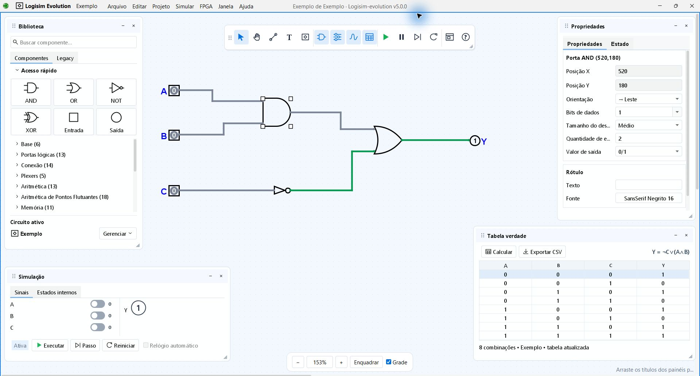

# Logisim Panels — experimental interface

An independent interface experiment for Logisim Evolution 5.0.0. The workspace uses movable panels and a movable, resizable icon toolbar while retaining the original circuit editor and simulator. This is an evaluation release, not an official Logisim Evolution release or a finished upstream integration.

[Português (Brasil)](README.md) · [Evaluation downloads](https://github.com/toybile/logisim-evolution/releases/tag/panels-v0.1.0) · [Upstream integration plan](docs/UPSTREAM-INTEGRATION.md)

## Screenshots

Actual screenshots of the Windows evaluation build, showing the included example circuit. These captures use Portuguese (Brazil); English is the application default.



The icon toolbar reflects the open panels. Simulation controls operate the circuit inputs, and the truth table includes its propositional equation. Panels and the toolbar can be moved and resized.


Appearance settings control language, workspace theme, selection and logic-1 colors, opacity and transitions independently.

## Try it

- **Windows x64:** download and fully extract `Logisim-Panels-0.1.0-windows-x64.zip`, then open **Logisim Panels.exe**.
- **Linux x64:** download and extract `Logisim-Panels-0.1.0-linux-x64.tar.gz`, then run `./start.sh`. Run `./example.sh` to open the included circuit; `./install-menu.sh` adds an application menu shortcut.
- Both packages include Java Temurin 21, Logisim Evolution, corresponding application sources and license notices. No separate Java or Logisim installation is needed.
- Linux requires a graphical desktop supporting X11/XWayland and the usual desktop/font libraries. Its GUI has not yet been tested on a real Linux desktop.
- Download `SHA256SUMS.txt` to verify the archives. This release is unsigned.

## Workspace

- Move Library, Properties, Simulation and Truth table by their headers. Resize from every edge and corner, including the diagonal grip. Minimize or close each panel independently.
- Move and resize the icon toolbar into rows or columns. Its selected symbols reflect the panels that are open.
- Search the Library, collapse Quick access, or open the original explorer under **Legacy**.
- Edit native properties with undo, operate actual circuit inputs from Simulation, and export combinational truth tables with their propositional equations. The integrated table supports up to 10 input bits; use Simulation for sequential circuits.
- Choose workspace themes, selection and signal colors, panel opacity and subtle transitions in **Settings and appearance…**.
- English is the default; Portuguese (Brazil) is available. Preferences and layouts are stored in the user's profile.

Shortcuts: `Ctrl+Alt+1…4` toggles the panels; `Ctrl+Alt+0` hides them; `Esc` closes the focused panel.

## Build from source

This directory is a self-contained experimental subproject. It currently depends on the released Logisim Evolution 5.0.0 JAR, rather than on the fork's current Gradle output.

Requires JDK 21+ and Python 3.11+. Download the official `logisim-evolution-5.0.0-all.jar` into `vendor/`, then run from this directory:

```sh
python scripts/build.py --jdk /path/to/jdk --tests
```

On Windows, quote a JDK path containing spaces. The tests create windows; on Linux, run them with `xvfb-run -a` for a virtual display. The interface JAR must precede the native JAR on the classpath; see `scripts/start.sh`. Portable packaging is documented in `vendor/README.md` and `scripts/package.py`.

## Evidence and limitations

| Verification | Result |
|---|---|
| Functional checks: editor integration, simulation, resizing/layout, appearance, pin alignment and language | 350 passed locally on Windows; automated suites also passed on Windows and Ubuntu/Xvfb |
| Distribution files, resources, sources, Linux permissions and SHA-256 | 28 package checks passed locally |

[Successful Windows and Ubuntu/Xvfb run](https://github.com/toybile/logisim-evolution/actions/runs/37790235710) · [Detailed verification report](docs/VERIFICACOES.md)

These are targeted checks, not complete coverage of every Logisim feature. FPGA, HDL and all third-party libraries have not been individually audited. A real Linux desktop test is still pending; Xvfb provides a virtual display.

## Contributing to this experiment

The fork keeps the upstream `main` branch unchanged. The experiment is on the `logisim-panels` branch, under `experimental/logisim-panels/`. Feedback can describe the circuit and action used, expected/actual behavior, OS, scaling and screenshot. Please omit personal information from circuit files and logs.

The implementation uses an independent launcher and a visual override of `Probe.java`. Integrating it into upstream requires architectural changes, native build/localization integration and agreement with the maintainers; publishing this fork does not imply acceptance.

## License and credits

GPL v3; preserve the original Logisim Evolution credits and license. Nunito uses the SIL Open Font License. Bundled Java carries its own license and notices. Corresponding application source is included in each application download. See [third-party notices](docs/THIRD-PARTY.md).
